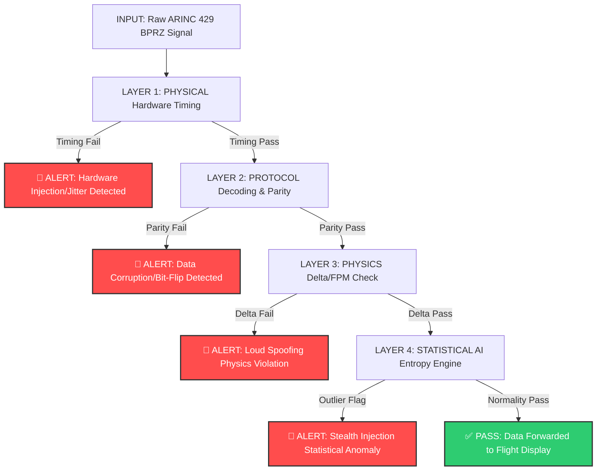

# Project-ARINC-429-IDS

Researching a software-based IDS for legacy ARINC 429 avionics. We use Shannon Entropy to detect data injection and spoofing attacks. By analyzing bitstream statistical anomalies, this zero-hardware solution provides a lightweight security layer for connected aircraft without breaking legacy compatibility.

## Why this research?
Modern aircraft are no longer "air-gapped." With the rise of SATCOM gateways and electronic flight bags, there are new ways for attackers to reach the internal ARINC 429 bus. Since this protocol has no built-in authentication, we are exploring how to detect "fake" data using math instead of new hardware.

## Our Approach
We are testing if a multi-layered detection pipeline using **Shannon Entropy** and an AI brain can catch these attacks. Legitimate flight data (like altitude) follows a predictable, low-entropy pattern, whereas an injection attack introduces "statistical noise." The IDS processes incoming signals through a 4-layer defense pipeline with sequential early-exit logic:

## Project Structure
We are keeping a daily log of our work to show how our research evolves over this 14-day sprint.
* [`/logs`](https://github.com/quasarx-snips/Project-ARINC-429-IDS/tree/main/logs): Our daily research journals and observations.
* [`/docs`](https://github.com/quasarx-snips/Project-ARINC-429-IDS/tree/main/docs): Technical notes on BPRZ and ARINC 429 specs.
* [`/src`](https://github.com/quasarx-snips/Project-ARINC-429-IDS/tree/main/src): The Python-based entropy engine.

## Statement of Tools & Academic Integrity
This research project utilizes the following third-party tools to support data processing:
- **PyARINC429 (GitHub):** This shall be used for learning purposes only.
- **BoodleBox AI (Gemini 3 Flash):** Used as a research assistant for technical documentation synthesis and logic brainstorming.

All core Intrusion Detection logic, Shannon Entropy implementations, AI Brain logic and anomaly detection thresholds are the original work of the authors.

## The Researcher
* **Bibhab:** 

---
*This repository is a work-in-progress for a formal research study (May 29 - June 14, 2026).*
