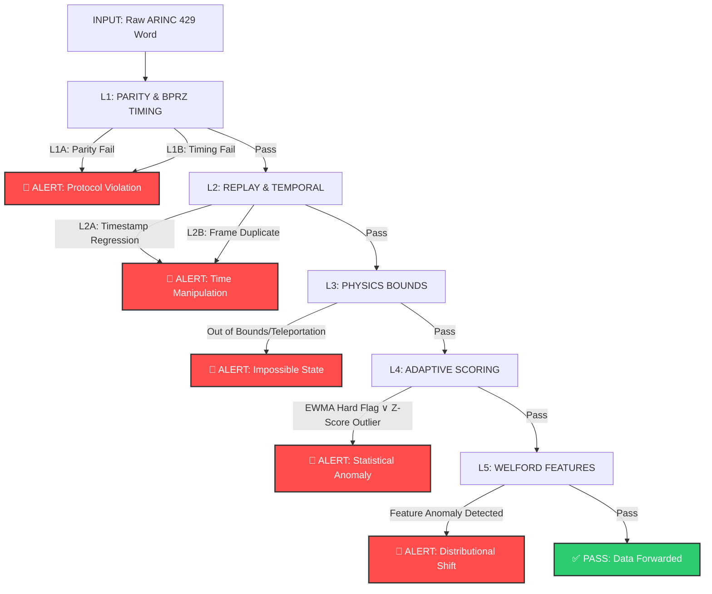

# Project-ARINC-429-IDS

Researching a software-based IDS for legacy ARINC 429 avionics. We use a **5-layer defense-in-depth detection pipeline** combining protocol validation, temporal integrity checks, physics constraints, adaptive baseline learning, and multi-feature anomaly detection to catch data injection and spoofing attacks. This zero-hardware solution provides lightweight security for connected aircraft without breaking legacy compatibility.

## Why this research?

Modern aircraft are no longer "air-gapped." With the rise of SATCOM gateways and electronic flight bags, there are new ways for attackers to reach the internal ARINC 429 bus. Since this protocol has **no built-in authentication or encryption**, a compromised gateway becomes a direct injection point for malicious altitude, heading, or airspeed data—potentially fatal to flight safety.

Our approach: **detect** impossible flight states and statistical anomalies rather than trying to prevent gateway compromise.

## Our Approach

We use a **Defense-in-Depth, 5-layer pipeline** that combines:

1. **L1 - Protocol Validation** (Bit-level): Parity checks + BPRZ signal timing verification
2. **L2 - Temporal Integrity** (Frame-level): Timestamp monotonicity + per-label frame deduplication  
3. **L3 - Physics Constraints** (Value-level): Impossible state detection (teleportation via max_delta bounds)
4. **L4 - Adaptive Baseline Learning** (Statistical): EWMA + rolling z-scores detect sustained anomalies
5. **L5 - Multi-feature Anomaly Detection** (Distributional): Online Welford algorithm learns feature covariance, flags outliers

**Key insight:** An attacker must evade **all 5 layers simultaneously**, making this a high-confidence defense. Legitimate flight data passes all layers; injected data trips at least one.

## Detection Pipeline Architecture

## Detection Pipeline Layers

| Layer | Purpose | Detection Method | Warmup | False-Neg Risk |
|-------|---------|-----------------|--------|---|
| **L1A** | Parity Integrity | Odd parity check (32-bit word) | Immediate | Zero (protocol) |
| **L1B** | BPRZ Timing | Signal timing 4.75–5.25 µs | Immediate | Zero (physical) |
| **L2A** | Temporal Continuity | Timestamp monotonicity (regression check) | Immediate | Low (time-based) |
| **L2B** | Replay Prevention | Per-label frame deduplication (20-frame window) | Immediate | Low (exact match) |
| **L3** | Physics Compliance | Value bounds + kinematic delta checks (`max_delta`) | Immediate | Medium (stealthy moves) |
| **L4** | Adaptive Anomaly | EWMA (50%) + Z-Score rolling buffer (30%) | 15 frames | Medium (learned baseline) |
| **L5** | Feature Anomaly | Welford online learning per-feature z-scores | 30 frames | Low (distributional) |

**Scoring Aggregation:** Combined = 50% L4_EWMA + 30% L4_ZScore + 20% L5_Welford  
**Alert Threshold:** Combined ≥ 80.0 OR EWMA_Hard=True

## Testing & Evaluation

We validate against **3 attack vectors**:

- **Teleport Attack** (`teleport_attack.csv`): Impossible altitude jumps (exceeds `max_delta` constraint) → Caught by **L3**
- **Parity Poison** (`parity_poison.csv`): Corrupted parity bit → Caught by **L1A**
- **Replay Attack** (`replay_attack.csv`): Duplicate frames with old/same timestamps → Caught by **L2A/L2B**

**Metrics Tracked:**
- Per-layer catch rate (attribution: which layer stopped each attack)
- Precision, Recall, F1-Score, Matthews Correlation Coefficient (MCC)
- False positive rate across clean flight data
- Layer breakdown distribution

## Project Structure

We are keeping a daily log of our work to show how our research evolves over this 14-day sprint.

* [`/logs`](https://github.com/quasarx-snips/Project-ARINC-429-IDS/tree/main/logs): Our daily research journals and observations.
* [`/docs`](https://github.com/quasarx-snips/Project-ARINC-429-IDS/tree/main/docs): Technical notes on BPRZ, ARINC 429 specs, and data format.
* [`/src`](https://github.com/quasarx-snips/Project-ARINC-429-IDS/tree/main/src): Python-based IDS core modules (layer implementations, decoders, metadata).
* [`/data`](https://github.com/quasarx-snips/Project-ARINC-429-IDS/tree/main/data): Attack simulation datasets and test vectors.

## Project Timeline

- **May 29 (Day 1)**: BPRZ physical layer & gateway pivot analysis
- **May 30 (Day 2)**: BNR data mapping & scope refinement (20+ labels)
- **May 31 (Day 3)**: Entropy detection baseline & Kanban architecture
- **June 1 (Day 4)**: Attack simulation frameworks (teleport, parity, replay)
- **June 2–3 (Days 5–6)**: Five-layer pipeline implementation ✓
- **June 4–10**: Integration testing, baseline calibration, performance profiling
- **June 11–14**: Documentation, red-team validation, final hardening

## Statement of Tools & Academic Integrity

**AI/Tools Used:**
- **GitHub Copilot**: Structural guidance on 5-layer pipeline architecture, orchestration design, and code organization
- **Google Gemini (Flash)**: Research synthesis, technical documentation, data generation for test datasets
- **PyARINC429**: Learning reference only (not directly used in final implementation)

**Original Work:**
All five detection layers (L1–L5), adaptive ML implementations, Welford online learning, feature extraction logic, scoring aggregation weights (50/30/20), anomaly detection thresholds, and attack simulation frameworks are original research by the authors.

## The Research Team

**Bibhab Saha** — Lead Researcher & IDS Architect

---

*This repository is a work-in-progress for a formal research study (May 29 – June 14, 2026).*
